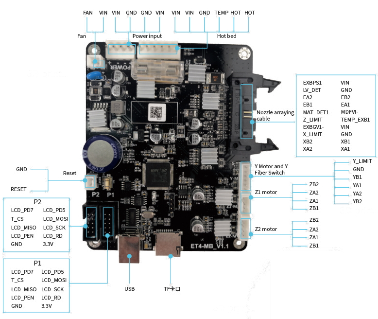

# Marlin for ET4/5 series 3D printers

This project is an effort to try to adapt the Anet ET4/ET5 motherboard and display for use with Marlin.
Anyone can contribute to completing this project. Feedback is also welcome.

# Context

As I don't have a blog, I would like to leave a personal opinion here related with this project experience. To whom it may concern.

I started this project as a hobby, on the one hand in response to the demand from the Anet ET series user community (including myself) for a quality and versatile firmware for their printers, and on the other hand, of Anet's refusal to provide solutions to problems and shortcomings of the stock firmware (a [change.org](https://www.change.org/p/anet-open-firmware-for-the-anet-et4) was even launched)

Without much knowledge of either Marlin or the closed ET hardware, and with help from the community, we have Marlin in the ET series from some time now. It is hard to believe that a company that claims to be a leader in the 3D printing industry will not be able to employ some engineering resources to port Marlin. Or even to improve its own firmware, which most remarkable milestone on recent released V3.0.0 (jump from V1.x), is to support some new languages... 

It was also a surprise (or not so much seeing it in perspective) that, in a very timely manner, Anet contacted me to get on the open source bandwagon and offer me a paid collaboration, which, although it never took place, they rushed to make it public along with an open source campaign, providing Anet a kind of reconciliation with the community appearing to be involved in this project, and a way of selling more printers. Objective accomplished.

In summary, after some time dealing with Anet, my personal experience has been regrettable. The lack of seriousness shown by the company (even the CEO) is hard to believe. The only concern in this whole project has been from the marketing and sales point of view, never from their users needing, as they want to do see. Anet's style is more in line with the "let them solve it themselves, and we will take advantage of it" of a mediocre company of the heap than with the innovative company, concerned about the user experience that they want to pretend to be (or show).

## Current status

### Working:
  - XYZ Steppers
  - Extruder
  - SD Card
  - USB comunication / pronterface
  - TFT
  - Filament runout detector.
  - EEPROM (Flash emulation)
  - Powerloss.
  - [Bltouch](https://github.com/davidtgbe/Marlin/blob/bugfix-2.0.x/docs/Tutorials/bltouch-en.md)
  
### On progress:
  - PC/SD firmware load/update: I've managed to get working OpenBLT, (PC-USB / SD / DFU) updates. ~~I'm still looking for a way to do a first time flash without flasher~~. Even so, a hardware flasher is very recommended for its price.
  - Take advantage of onboard EEPROM I2C instead of emulated flash.
 
### To take a look:
  - All files on path "Marlin\buildroot\share\PlatformIO\variants\ET4\" should be adapted to ET4/5 Board. Specially peripheralPins.c, variant.cpp, variant.h etc..
 
### Known bugs:

I have enabled issues tab. Please, try to be detailed regarding use cases and other useful information like hardware and software context. 
To get help on creating an issue see [this](https://docs.github.com/en/enterprise/2.15/user/articles/creating-an-issue).

## BUILD/INSTALLATION

  DISCLAIMER: Not for production use. This is an unfinished project and under development. I am not responsible for what may happen to the motherboard or printer. Use only at your own risk.

Currently you can only flash this firmware using a flasher (stlink, jlink, bmp etc), **unless** you already have flashed the openblt bootloader (BL).

## Before flashing this firmware (optional, but recommended):  

First time, I recommend making a backup of your firmware. At least your bootloader (addresses from 0x08000000 to 0x08010000). This way, you can always recover/return to stock firmware by:  
  1. flashing the bootloader backup, from address 0x08000000 to 0x8010000.  
  2. flashing any of the available Anet firmwares from address 0x08010000 onwards.  

If you don't perform this step, and, just in case of brick, there are copies of stock firmware ET4 releases and bootloader below on [resources](https://github.com/davidtgbe/Marlin#resources) section.

## Considerations

You have two options to install/update this firmware:
- **Option A** > ***Not using a bootloader (BL)*** 
  - Firmware (Marlin) starts directly when you switch on the printer.
  - You need the flasher to perform firmware installation/updates.
- **Option B** > ***Using a bootloader along with this firmware***
  - When you switch on the printer, bootloader (BL) starts first, and, if there are not any firmware updates incomming (on SD or through PC-USB), it loads the firmware (Marlin).
  - You need the flasher to **flash the BL** the first time. Once it is flashed, you **MUST** install/update your FW through your **BL**, either by **SD card or USB-PC**. You **MUST NOT** use the **flasher** to install/update the FW, as it will not work.

## Step One: Building from sources

1. Download or clone this [repo](https://github.com/davidtgbe/Marlin/archive/bugfix-2.0.x.zip). Ensure you build the firmware with **latest sources**, as firmware.srec file will not be built with older sources.

2. Make sure to modify your config.h and config_adv.h according to your ET4/5 model (ET4, ET5, ET4 PRO, ET4+, ...) or you can also use [EasyConfig](https://github.com/davidtgbe/Marlin/blob/bugfix-2.0.x/Marlin/EasyConfig.h) for a simple configuration experience.
    - Settings as driver model (A4988/TMC2208), Z endstop position (UP/DOWN), TFT resolution, XYZ size, homming offsets, auto bed levelling sensor, etc, need to be defined according to your model.
    - Provided configuration.h and configuration_adv.h files correspond to a regular ET4/TMC2208 model with attachable bed levelling sensor.
    - Fine tunning could be needed (e.g. XYZE [steps](https://marlinfw.org/docs/gcode/M092.html) or offsets, Jerks, JD, LA, etc).

3. If you are going to take **option A** from considerations section (not using a BL), **you can skip this step**. Otherwise, you need to offset the firmware to give some room to the BL. That is achieved by uncommenting a line in **platform.ini** file. It is commented by default:
```
#
# Anet ET4
#
[env:ET4]
...
...
# Uncomment next line to build for use with bootloader. Offset depends on BL used.
#board_build.offset  = 0x10000
...
...
```
Change "**#board_build.offset  = 0x10000**" to
```
board_build.offset = 0x10000
```
4. Build project with platform.io on VS code is recommended. There are many tutorials on the web. You can follow them, **ADAPTING** steps to build this project. This one [here](/docs/Tutorials/build-es.md) in spanish made by me, and just another one [here](https://3daddict.com/marlin-2-0-beginner-guide-for-3d-printer-firmware/).
5. If everything went well, you will find marlin binary files with extension **.[elf|bin|srec]**, generated in the build output folder:
```
<src_code_base_folder>\.pio\build\ET4\
```

## Step two Flashing/Installing the firmware  

There are several tutorials available for [stlink](https://www.cnx-software.com/2020/02/04/how-to-recover-from-a-bad-firmware-upgrade-on-anet-et4-3d-printer/)/[j-link](https://danielabalo.wordpress.com/flasear-anet-et4/) flashers. Take a look to them.

You have two options to install/update this firmware:
- **Option A >** If you are going to use the firmware **without** bootloader:
  -  It is assumed you have built your firmware with no offset (step 1.3 skipped) .
  -  As the firmware has been built without offset, and lacks of a bootloader, you have to just flash your firmware binary file (step 1.5) with your preferred flasher from address **0x8000000**.
- **Option B >** If you are going to use the firmware **with** bootloader:
  - You need to flash the bootloader from address **0x08000000**. This step needs to be performed just once, so, you can skip this step if you have already done so. You can download the precompiled bootloader [binary](https://github.com/davidtgbe/openblt/releases), or, you can build it yourself from source code using [STM32 Cube IDE](https://www.st.com/en/development-tools/stm32cubeide.html).
  - After flashing the BL, you can disconnect your flasher, it will not be used anymore.
  - Now it is time to install de firmware. BL will assist us in this task, so, you must use a SD-CARD **OR** USB-PC/microboot to flash perform this step.
    - SD-CARD -> Copy file **firmware.srec** from build folder (step 1.5) in the root folder of the SD-CARD.
    - USB-PC/microboot -> 
      - Download microboot software. It is uploaded to github and you can download it from [here](https://github.com/davidtgbe/openblt/archive/master.zip).
      - Extract the .zip file you have just downloaded and browse to the folder **openblt/Host/**. You will find the **microboot.exe** executable.
      - Connect your printer via USB to your PC and get the COM port number.
      - Open **microboot.exe** executable and configure COM port number and speed (115200) through **settings** button. Then, click **browse** and search for the file **firmware.srec**. You will find it in the output build folder (step 1.5).
  - Switch off and then switch on the printer to begin the installation/update process.
  - ~~Screen will be white during the process, and, after 3 or 4 minutes, Marlin will appear on the screen.~~ If you have latest OpenBLT release, you will see the update process on screen and Marlin will start after flashing process.

You can connect with pronterface to corresponding COM port @115200bps.

### Flashing considerations

If you use bootloader, you **must not use the flasher to install/update the FW**. The bootloader inserts a special **checksum** in the firmware during the install/update process. Bootloader **checks** for this checksum before jumping to the firmware. If you use your **flasher** to install the firmware, this **checksum is not written**, and, therefore, bootloader **will not boot** the firmware ~~, and **your screen will be white**.~~ and OpenBLT will ask you to flash a firmware.

**DFU** mode (Device Firmware Upgrade) has been added to the bootloader. You can enter to it just by **pressing touchscreen while switching printer on**. By using DFU mode you can even update your bootloader without needing a hardware flasher, just using the PC-USB and the right [tool](https://www.st.com/en/development-tools/flasher-stm32.html).


*More info:*  
[SD-CARD update process](https://www.feaser.com/openblt/doku.php?id=manual:sdcard_demo)  
[PC-USB update process](https://www.feaser.com/openblt/doku.php?id=manual:microboot)
[OpenBLT project](https://github.com/davidtgbe/openblt)

## HARDWARE



MCU: [STM32F407VGT6 ARM CORTEX M4](https://www.st.com/resource/en/datasheet/dm00037051.pdf)  
DRIVERS: [TMC2208 (silent)](https://www.trinamic.com/fileadmin/assets/Products/ICs_Documents/TMC220x_TMC2224_datasheet_Rev1.09.pdf) / [A4988 (noisy)](https://www.pololu.com/file/0J450/a4988_DMOS_microstepping_driver_with_translator.pdf)  
USB TO SERIAL CONVERTER: [CH340G](https://www.mpja.com/download/35227cpdata.pdf)  
SERIAL FLASH MEMORY: [WINBOND W25Q128JVSQ (128M-bit)](https://www.winbond.com/resource-files/w25q128jv%20revf%2003272018%20plus.pdf)  
EEPROM: [AT24C04C (ATMLH744 04CM) 4 Kb](https://datasheet.lcsc.com/szlcsc/1809192313_Microchip-Tech-AT24C04C-SSHM-T_C6205.pdf)  
LCD ET4: [ST7789 @ 320x240 | STP320240_0280E2T (40P/1,5): ST7789 (YT280S008)](https://a.aliexpress.com/_dV4Bghv) | [ST7789V](https://www.crystalfontz.com/controllers/Sitronix/ST7789V/470/)  
LCD ET5: [ST7796S @ 480x320](https://www.displayfuture.com/Display/datasheet/controller/ST7796s.pdf)  
TOUCH: [XPT2046](https://ldm-systems.ru/f/doc/catalog/HY-TFT-2,8/XPT2046.pdf)  
MOSFETS (BED/HOTEND): [G90N04](https://datasheet.lcsc.com/szlcsc/1811281041_GOFORD-G90N04_C337510.pdf)  
CLK: JF8.000 (8MHZ MCU EXT CLK)  
CLK: JF12.000 (12 MHZ USB-UART CLK)  
SCHOTTKY DIODE: [SS56](https://www.taitroncomponents.com/catalog/Datasheet/SS52.pdf)  
REGULATOR: [AMS1117 3.3 DN811](http://www.advanced-monolithic.com/pdf/ds1117.pdf)  
MOSFET: [030N06](https://www.alldatasheet.es/view.jsp?Searchword=030N06&sField=3)  
MOSFET: [A19T](https://datasheetspdf.com/pdf/1401820/UMW/A19T/1)  
STEP DOWN DC CONVERTER: [XL2596S -5.0E1 83296 ](https://datasheetspdf.com/datasheet/XL2596.html)  
VOLTAGE COMPARATOR: [293 STG9834 / LM293DT](https://www.st.com/resource/en/datasheet/lm193.pdf)  

## PIN MAPPING

E-STEP => PB9  
E-DIR => PB8  
E-ENABLE => PE0  
  
X-STEP => PB6  
X-DIR => PB5  
X-ENABLE => PB7  
  
Y-STEP => PB3  
Y-DIR => PD6  
Y-ENABLE => PB4  
  
Z-STEP => PA12  
Z-DIR => PA11  
Z-ENABLE => PA15  
  
Y-LIMIT => PE12  
X-LIMIT => PC13  
Z-LIMIT => PE11  
  
TEMP_BED => PA4  
TEMP_EXB1 => PA1  
  
END_FAN => PE1  
LAY_FAN => PE3  
  
END_CONTROL => PA0  
BED_CONTROL => PE2  
  
LV_DET => PC3  
MAT_DET1 => PA2  
POWER_LOSS_DET => PA8 (PANET)
POWER_LOSS_SUPERCAP_SWITCH => PA3 (Zhiniukas & SidDrP)
  
SDIO_D2 => PC10  
SDIO_D3 => PC11  
SDIO_CMD => PD2  
SDIO_CLK => PC12  
SDIO_D0 => PC8  
SDIO_D1 => PC9  
TF_DET => PD3  
  
USB_USART1_TX => PA9  
USB_USART1_RX => PA10  
  
RESET_BTN => NRST (14)  
LED_D2 => PD12  
  
WINBOND_CS => PB12  
WINBOND_DO => PB14  
WINBOND_DI => PB15  
WINBOND_CLK => PB13  
  
EEPROM_A1 => GND  
EEPROM_A2 => GND  
EEPROM_SDA => PB11  
EEPROM_SCL => PB10  
  
P1_1_LCD_9_CSX => PD7  
P1_2_LCD_11_WRX => PD5  
P1_3_TOUCH_15_/CS => PB2  
P1_4_TOUCH_14_DIN => PE5  
P1_5_TOUCH_12_DOUT => PE4  
P1_6_TOUCH_16_DCLK => PB0  
P1_7_TOUCH_11_/PENIRQ => PB1  
P1_8_LCD_12_RDX => PD4  
P1_9 => GND  
P1_10 => 3.3V  
  
P2_1_LCD_15_RESX => PE6  
P2_2_LCD_10_DCX => PD13  
P2_3_LCD_26_DB9 => PD15  
P2_4_LCD_25_DB8 => PD14  
P2_5_LCD_28_DB11 => PD1  
P2_6_LCD_27_DB10 => PD0  
P2_7_LCD_30_DB13 => PE8  
P2_8_LCD_29_DB12 => PE7  
P2_9_LCD_32_DB15 => PE10  
P2_10_LCD_31_DB14 => PE9  

## Resources

[ET4 Telegram Spanish Group Resources](https://drive.google.com/drive/folders/1bVusF9dMh1H7c2JM5ZWlbn2tWRGKsHre)  
[ET4 Board and specs](https://es.aliexpress.com/item/4000571722465.html?spm=a2g0o.productlist.0.0.5c647634dDFWSV&algo_pvid=9a06cdcd-c1f2-45a0-adcf-36da50fefff7&algo_expid=9a06cdcd-c1f2-45a0-adcf-36da50fefff7-2&btsid=0ab6f83115911132482433653e39a1&ws_ab_test=searchweb0_0,searchweb201602_,searchweb201603_)

## Acknowledgements

- To the mates of the [Telegram Anet ET4 spanish group](https://t.me/anetet4esp), specially to @Solidnon, who lent his board for testing when the project was not even started.
- To @uwe and @mubes from Black Magic Probe team, and to Ebiroll (BMP/ESP32).
- To all contributors and testers of this branch and, specially, of Marlin master branch.

# Marlin 3D Printer Firmware


[](https://github.com/MarlinFirmware/Marlin/actions)


Additional documentation can be found at the [Marlin Home Page](https://marlinfw.org/).
Please test this firmware and let us know if it misbehaves in any way. Volunteers are standing by!

## Marlin 2.0 Bugfix Branch

__Not for production use. Use with caution!__

Marlin 2.0 takes this popular RepRap firmware to the next level by adding support for much faster 32-bit and ARM-based boards while improving support for 8-bit AVR boards. Read about Marlin's decision to use a "Hardware Abstraction Layer" below.

This branch is for patches to the latest 2.0.x release version. Periodically this branch will form the basis for the next minor 2.0.x release.

Download earlier versions of Marlin on the [Releases page](https://github.com/MarlinFirmware/Marlin/releases).

## Building Marlin 2.0

To build Marlin 2.0 you'll need [Arduino IDE 1.8.8 or newer](https://www.arduino.cc/en/main/software) or [PlatformIO](https://docs.platformio.org/en/latest/ide.html#platformio-ide). We've posted detailed instructions on [Building Marlin with Arduino](https://marlinfw.org/docs/basics/install_arduino.html) and [Building Marlin with PlatformIO for ReArm](https://marlinfw.org/docs/basics/install_rearm.html) (which applies well to other 32-bit boards).

## Hardware Abstraction Layer (HAL)

Marlin 2.0 introduces a layer of abstraction so that all the existing high-level code can be built for 32-bit platforms while still retaining full 8-bit AVR compatibility. Retaining AVR compatibility and a single code-base is important to us, because we want to make sure that features and patches get as much testing and attention as possible, and that all platforms always benefit from the latest improvements.

### Current HALs

  #### AVR (8-bit)

  board|processor|speed|flash|sram|logic|fpu
  ----|---------|-----|-----|----|-----|---
  [Arduino AVR](https://www.arduino.cc/)|ATmega, ATTiny, etc.|16-20MHz|64-256k|2-16k|5V|no

  #### DUE

  boards|processor|speed|flash|sram|logic|fpu
  ----|---------|-----|-----|----|-----|---
  [Arduino Due](https://www.arduino.cc/en/Guide/ArduinoDue), [RAMPS-FD](https://www.reprap.org/wiki/RAMPS-FD), etc.|[SAM3X8E ARM-Cortex M3](https://www.microchip.com/wwwproducts/en/ATsam3x8e)|84MHz|512k|64+32k|3.3V|no

  #### ESP32

  board|processor|speed|flash|sram|logic|fpu
  ----|---------|-----|-----|----|-----|---
  [ESP32](https://www.espressif.com/en/products/hardware/esp32/overview)|Tensilica Xtensa LX6|160-240MHz variants|---|---|3.3V|---

  #### LPC1768 / LPC1769

  boards|processor|speed|flash|sram|logic|fpu
  ----|---------|-----|-----|----|-----|---
  [Re-ARM](https://www.kickstarter.com/projects/1245051645/re-arm-for-ramps-simple-32-bit-upgrade)|[LPC1768 ARM-Cortex M3](https://www.nxp.com/products/microcontrollers-and-processors/arm-based-processors-and-mcus/lpc-cortex-m-mcus/lpc1700-cortex-m3/512kb-flash-64kb-sram-ethernet-usb-lqfp100-package:LPC1768FBD100)|100MHz|512k|32+16+16k|3.3-5V|no
  [MKS SBASE](https://reprap.org/forum/read.php?13,499322)|LPC1768 ARM-Cortex M3|100MHz|512k|32+16+16k|3.3-5V|no
  [Selena Compact](https://github.com/Ales2-k/Selena)|LPC1768 ARM-Cortex M3|100MHz|512k|32+16+16k|3.3-5V|no
  [Azteeg X5 GT](https://www.panucatt.com/azteeg_X5_GT_reprap_3d_printer_controller_p/ax5gt.htm)|LPC1769 ARM-Cortex M3|120MHz|512k|32+16+16k|3.3-5V|no
  [Smoothieboard](https://reprap.org/wiki/Smoothieboard)|LPC1769 ARM-Cortex M3|120MHz|512k|64k|3.3-5V|no

  #### SAMD51

  boards|processor|speed|flash|sram|logic|fpu
  ----|---------|-----|-----|----|-----|---
  [Adafruit Grand Central M4](https://www.adafruit.com/product/4064)|[SAMD51P20A ARM-Cortex M4](https://www.microchip.com/wwwproducts/en/ATSAMD51P20A)|120MHz|1M|256k|3.3V|yes

  #### STM32F1

  boards|processor|speed|flash|sram|logic|fpu
  ----|---------|-----|-----|----|-----|---
  [Arduino STM32](https://github.com/rogerclarkmelbourne/Arduino_STM32)|[STM32F1](https://www.st.com/en/microcontrollers-microprocessors/stm32f103.html) ARM-Cortex M3|72MHz|256-512k|48-64k|3.3V|no
  [Geeetech3D GTM32](https://github.com/Geeetech3D/Diagram/blob/master/Rostock301/Hardware_GTM32_PRO_VB.pdf)|[STM32F1](https://www.st.com/en/microcontrollers-microprocessors/stm32f103.html) ARM-Cortex M3|72MHz|256-512k|48-64k|3.3V|no

  #### STM32F4

  boards|processor|speed|flash|sram|logic|fpu
  ----|---------|-----|-----|----|-----|---
  [STEVAL-3DP001V1](https://www.st.com/en/evaluation-tools/steval-3dp001v1.html)|[STM32F401VE Arm-Cortex M4](https://www.st.com/en/microcontrollers-microprocessors/stm32f401ve.html)|84MHz|512k|64+32k|3.3-5V|yes

  #### Teensy++ 2.0

  boards|processor|speed|flash|sram|logic|fpu
  ----|---------|-----|-----|----|-----|---
  [Teensy++ 2.0](https://www.microchip.com/wwwproducts/en/AT90USB1286)|[AT90USB1286](https://www.microchip.com/wwwproducts/en/AT90USB1286)|16MHz|128k|8k|5V|no

  #### Teensy 3.1 / 3.2

  boards|processor|speed|flash|sram|logic|fpu
  ----|---------|-----|-----|----|-----|---
  [Teensy 3.2](https://www.pjrc.com/store/teensy32.html)|[MK20DX256VLH7](https://www.mouser.com/ProductDetail/NXP-Freescale/MK20DX256VLH7) ARM-Cortex M4|72MHz|256k|32k|3.3V-5V|yes

  #### Teensy 3.5 / 3.6

  boards|processor|speed|flash|sram|logic|fpu
  ----|---------|-----|-----|----|-----|---
  [Teensy 3.5](https://www.pjrc.com/store/teensy35.html)|[MK64FX512VMD12](https://www.mouser.com/ProductDetail/NXP-Freescale/MK64FX512VMD12) ARM-Cortex M4|120MHz|512k|192k|3.3-5V|yes
  [Teensy 3.6](https://www.pjrc.com/store/teensy36.html)|[MK66FX1M0VMD18](https://www.mouser.com/ProductDetail/NXP-Freescale/MK66FX1M0VMD18) ARM-Cortex M4|180MHz|1M|256k|3.3V|yes

  #### Teensy 4.0 / 4.1

  boards|processor|speed|flash|sram|logic|fpu
  ----|---------|-----|-----|----|-----|---
  [Teensy 4.0](https://www.pjrc.com/store/teensy40.html)|[IMXRT1062DVL6A](https://www.mouser.com/new/nxp-semiconductors/nxp-imx-rt1060-crossover-processor/) ARM-Cortex M7|600MHz|1M|2M|3.3V|yes
  [Teensy 4.1](https://www.pjrc.com/store/teensy41.html)|[IMXRT1062DVJ6A](https://www.mouser.com/new/nxp-semiconductors/nxp-imx-rt1060-crossover-processor/) ARM-Cortex M7|600MHz|1M|2M|3.3V|yes

## Submitting Patches

Proposed patches should be submitted as a Pull Request against the ([bugfix-2.0.x](https://github.com/MarlinFirmware/Marlin/tree/bugfix-2.0.x)) branch.

- This branch is for fixing bugs and integrating any new features for the duration of the Marlin 2.0.x life-cycle.
- Follow the [Coding Standards](https://marlinfw.org/docs/development/coding_standards.html) to gain points with the maintainers.
- Please submit your questions and concerns to the [Issue Queue](https://github.com/MarlinFirmware/Marlin/issues).

### [RepRap.org Wiki Page](https://reprap.org/wiki/Marlin)

## Credits

The current Marlin dev team consists of:

 - Scott Lahteine [[@thinkyhead](https://github.com/thinkyhead)] - USA &nbsp; [Donate](https://www.thinkyhead.com/donate-to-marlin) / Flattr: [](https://flattr.com/submit/auto?user_id=thinkyhead&url=https://github.com/MarlinFirmware/Marlin&title=Marlin&language=&tags=github&category=software)
 - Roxanne Neufeld [[@Roxy-3D](https://github.com/Roxy-3D)] - USA
 - Chris Pepper [[@p3p](https://github.com/p3p)] - UK
 - Bob Kuhn [[@Bob-the-Kuhn](https://github.com/Bob-the-Kuhn)] - USA
 - João Brazio [[@jbrazio](https://github.com/jbrazio)] - Portugal
 - Erik van der Zalm [[@ErikZalm](https://github.com/ErikZalm)] - Netherlands &nbsp; [](https://flattr.com/submit/auto?user_id=ErikZalm&url=https://github.com/MarlinFirmware/Marlin&title=Marlin&language=&tags=github&category=software)

## License

Marlin is published under the [GPL license](/LICENSE) because we believe in open development. The GPL comes with both rights and obligations. Whether you use Marlin firmware as the driver for your open or closed-source product, you must keep Marlin open, and you must provide your compatible Marlin source code to end users upon request. The most straightforward way to comply with the Marlin license is to make a fork of Marlin on Github, perform your modifications, and direct users to your modified fork.

While we can't prevent the use of this code in products (3D printers, CNC, etc.) that are closed source or crippled by a patent, we would prefer that you choose another firmware or, better yet, make your own.
