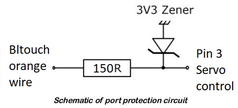

# How to install bltouch on Anet ET series 3D printers

This tutorial covers the basic and necessary aspects to be able to install a bltouch in the Anet ET series (ET4/ET5). Aspects such as wiring routing will not be covered, leaving the user the solution that he deems most appropriate.

## Disclaimer
Not for production use. 
This mod requires some hardware modifications that will void your warranty. I am not responsible for what may happen to the motherboard or printer. Use only at your own risk.

## Previous requirements

1. [Marlin FW](https://github.com/davidtgbe/Marlin)

2. [Bltouch Smart](https://a.aliexpress.com/_BUlp8P). There are a many versions and clones. I have bought **2020 smart version from trianglelab**.

3. [Step Down Converter 24V DC to 5V DC](https://a.aliexpress.com/_BU2xKx) (at least 500mA). There are a lot of possibilities here. Bltouch [specs](https://5020dafe-17d8-4c4c-bf3b-914a8fdd5140.filesusr.com/ugd/f5a1c8_d40d077cf5c24918bd25b6524f649f11.pdf) states a peak current consumption of **300mA**, so I've used one module based on the MP1584 IC. It is cheap, small, and will supply the **5V DC** voltage needed to feed the bltouch. There are many other possibilities though...
   
4. Soldering iron or hot air gun and **SMD soldering/desoldering skills**. 

# Hardware mod

There are no free exposed pins/expansion ports in the ET4/5 motherboard, so, we have to make do with what we have.

Let's tale a look at the existing connections:

### ET4 board


### ET4 adapter (interconnection) board

There are two PCB models for this part, whose function is to expose pins from the 20 pin IDC wire to JST headers.

For the **regular ET4** with piezoelectric autolevel sensor, we have PCB shown below


and its connection diagram


For **ET4 models with inductive autolevel** sensor, you will have to **solder a JST header** to the interconnection board (*S-Z serigrafiated*). Likewise, autolevel will have a **3 pin JST header** in such case, instead of the 2 pins JST header of the regular ET4. 


Connection diagram for ET4 models with inductive autolevel


### Bltouch [specs](https://5020dafe-17d8-4c4c-bf3b-914a8fdd5140.filesusr.com/ugd/f5a1c8_d40d077cf5c24918bd25b6524f649f11.pdf)


**It is clear we are going to need:**
- the step-down converter to get 5V
- one signal for Zmin (sensor/input signal)
- one signal for the bltouch control (output/servo signal).

## Powering Bltouch

**Bltouch needs to be feed with 5V**, so we have to connect the **step-down module** to **convert the 24V available on pin 2/14, to 5V**. We can use a step-down converter like this one


and connect it as below


You can print any of the enclosures available on [thingiverse](https://www.thingiverse.com/tag:mp1584).

## Signals

We can reuse **Z-Limit (pin 11) for Z-min**, and **auto-level (pin 3) for the servo signal**. However, as pin 3 is a sensor signal, it is designed as a pull-up.


Resistor normaly sets input signal to VCC, and, when the switch closes, it sets input to GND. We need to turn the input into an output, so, we need to let te signal be controlled dynamically by the MCU, avoiding to be pulled up or down by passive components.
For this purpose, we need to **remove capacitor and resistor**, which, for the auto-level (pin 3), are serigrafiated on the motherboard as R40 and C37.

***Before desoldering***


***After desoldering***


As I dont't have a hot air gun to desolder the components, I have used two soldering irons, one on each pad of the component at the same time, trying to imitate [this](https://es.aliexpress.com/item/33050513257.html). There are other techniques and better tools which are not the target of this tutorial. 

## Wiring

**Note: Handle wiring with printer turned off and always **DOUBLE CHECK CONNECTIONS** before turning on the printer**

Once we have desoldered the resitor and capacitor, we need to wire all the things up.

**Connections Summary:**
- Power GND (Pin 4/16) **<=>** (In -) Step down converter (Out -) **<=>** Bltouch Power GND (Brown wire)
- Power VCC (Pin 2/14) **<=>** (In +) Step down converter (5V Out +) **<=>** Bltouch VCC (Red wire)
- Zmin (Pin 11) **<=>** Bltouch Zmin (White wire)
- Zmin GND (Pin 4/16) **<=>** Bltouch Signal GND (Black wire)
- Servo/Control (Pin 3) **<=>** Bltouch Control Signal (Orange wire)

We are going to need [JST splitters](https://es.aliexpress.com/item/32807855922.html). You can buy them or do it yourself using a [crimping plier](https://a.aliexpress.com/_mMSfo53) (SN-2549 model in this case) and [JST XH](https://a.aliexpress.com/_mr4Uu0h) aerial connectors. You can also employ any other solution which allows us to **share an already used pin** (like pin 2/14 (24V)) in the interconnection board. If you have 3 pins on the autolevel JST header, you can take advantage of this extra 24V pin to feed the step down converter. 


You can take 24V and GND pins from whatever JST connector in the interconnection board. I would take it from BL or FAN connectors, since the hotend JST tends burn out as many users have reported.

Bltouch GND points for signal and power can be merged/shared. If you have interferences or mal functioning, use a standalone wire for each GND. 

# Software

If you are using [EasyConfig](../../Marlin/EasyConfig.h), you just need to define BLTouch levelling method:
```
#define ET_LEVELLING        		ET_LV_BLTOUCH
```
If you are confuguring Marlin from scratch, you can find **changed files in this [link](https://github.com/davidtgbe/Marlin/tree/bugfix-2.0.x/config/users%20configs/ET4/davidtgbe_bltouch)** just to compare. Remember that Marlin config files are version dependant, so, copying and pasting full content won't likely work.

Below are changed lines on configuration.h and pins_et4.h.
If you want to take a look at the conversion table between the interconnection board and the MCU pin naming, go to pin mapping section [here](https://github.com/davidtgbe/Marlin).

**configuration.h**
```
#define USE_XMIN_PLUG
#define USE_YMIN_PLUG
#define USE_ZMIN_PLUG
//#define USE_XMAX_PLUG
//#define USE_YMAX_PLUG
//#define USE_ZMAX_PLUG 
...
//#define Z_MIN_PROBE_USES_Z_MIN_ENDSTOP_PIN
...
// Force the use of the probe for Z-axis homing
#define USE_PROBE_FOR_Z_HOMING
...
//#define NOZZLE_AS_PROBE
...
#define BLTOUCH
...
#define X_HOME_DIR -1
#define Y_HOME_DIR -1
#define Z_HOME_DIR -1
...
 /*    +-- BACK ---+
 *     |    [+]    |
 *   L |        1  | R <-- Example "1" (right+,  back+)
 *   E |  2        | I <-- Example "2" ( left-,  back+)
 *   F |[-]  N  [+]| G <-- Nozzle
 *   T |       3   | H <-- Example "3" (right+, front-)
 *     | 4         | T <-- Example "4" ( left-, front-)
 *     |    [-]    |
 *     O-- FRONT --+
 */

#define NOZZLE_TO_PROBE_OFFSET { 0, 0, 0 } // Change 0s to whatever offset you have
```
We are using:
- Auto-level pin (pin 3 / PC3) for Bltouch servo control.
- Z-limit pin (pin 11 / PE11) for Bltouch Z-min signal.

**pins_et4.h**
```
#define X_STOP_PIN                          PC13 
#define Y_STOP_PIN                          PE12
#define Z_MIN_PIN                           PE11
...
#ifndef Z_MIN_PROBE_PIN
  #define Z_MIN_PROBE_PIN                   PE11
#endif
...
#define SERVO0_PIN                          PC3
```

## GPIO protection
**Not tested. Not mandatory. Implement only if you have background on electronics**

Usually, a port protection network or optocoupler would be placed between the signal pin and the controlled device (bltouch in this case) to avoid GPIO damages in case of wrong wiring. There are a lot of designs. I haven't used it here because this pin is connected to a high impedance port on the bltouch, handles 3.3V logic levels and hardly any current. 

STM32F4 specs states that GPIOs can source/sink a max current of 25mA, so the min current limiting resistor value to be placed would have a value of 3.3V / 25 mA = 132 ohms. The 3.3V Zener clips over-voltage down to a safe voltage of 3.3V.



# Acknolegments
Thanks to:
- @Egoitz89 for the ET4 interconnection board scheme.
- Mates and, specially, admins of the [ET4 spanish telegram group](https://t.me/anetet4esp), for the 
immeasurable help and support they provide to Anet users.

# More info
https://all3dp.com/2/bltouch-sensors-guide/  
https://elinux.org/RPi_Tutorial_EGHS:GPIO_Protection_Circuits  
http://www.thebox.myzen.co.uk/Raspberry/Breakout.html  
https://electronics.stackexchange.com/questions/296107/stm32-clamping-diodes-what-is-the-maximum-input-voltage
